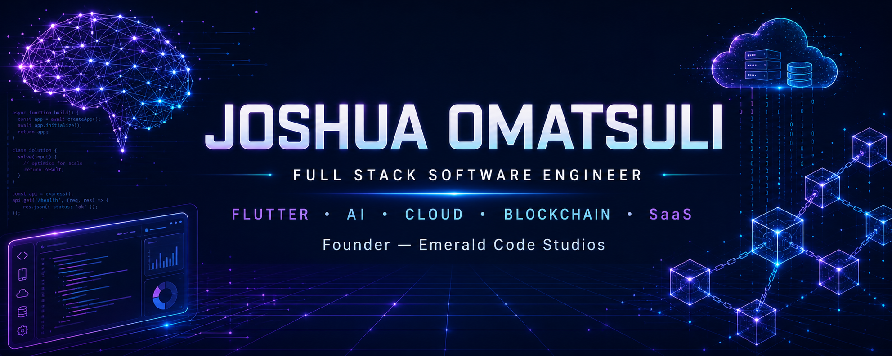

<div align="center">




[](https://github.com/Omatsulijoshua)
[](https://github.com/Omatsulijoshua?tab=followers)
[](https://github.com/Omatsulijoshua?tab=repositories)

</div>

## Hello, I'm Joshua 👋

I'm a Full Stack Software Engineer from Nigeria and the founder of **Emerald Code Studios**. I build production-ready products across mobile, web, artificial intelligence, cloud computing, and blockchain.

My work spans enterprise SaaS, AI systems, logistics, legal technology, education, finance, healthcare, 3D CAD, and creative digital experiences. I care about clean architecture, thoughtful design, and software that solves real problems.

```typescript
const joshua = {
  roles: ["Full Stack Engineer", "Flutter Developer", "AI Engineer", "Founder"],
  company: "Emerald Code Studios",
  focus: ["Mobile", "Web", "AI", "Cloud", "Blockchain", "SaaS"],
  mission: "Build scalable software that improves lives",
  status: "Always learning. Always building."
};
```

## 🚀 What I'm Building

<table>
<tr>
<td width="50%" valign="top">

### 🏗️ CADPILOT

Professional AI-powered CAD platform for iPad, combining 3D design, LiDAR, Apple Pencil, rendering, and augmented reality.

</td>
<td width="50%" valign="top">

### 🚚 Rider Logistics

AI-powered delivery platform with live tracking, route optimisation, payments, real-time notifications, and dedicated customer, driver, and admin apps.

</td>
</tr>
<tr>
<td width="50%" valign="top">

### 🤖 Conversa AI

Human-like voice AI customer support with natural conversations, multilingual agents, phone calls, and an integration-ready API.

</td>
<td width="50%" valign="top">

### ⚖️ Midlex AI

AI legal assistant for research, intelligent chat, case management, and modern law-firm operations.

</td>
</tr>
<tr>
<td width="50%" valign="top">

### 📚 ExamPrep AI

An intelligent learning platform for WAEC, JAMB, NECO, and SAT preparation with an AI tutor and performance analytics.

</td>
<td width="50%" valign="top">

### 💹 Crypto Exchange

A modern digital-asset platform featuring spot trading, wallets, staking, KYC, and a complete administration dashboard.

</td>
</tr>
<tr>
<td width="50%" valign="top">

### 📅 Planova

An AI scheduling and productivity platform designed to turn plans into focused, achievable action.

</td>
<td width="50%" valign="top">

### 🎨 Creative Technology

Interactive experiences that combine software engineering, visual storytelling, motion, and graphic design.

</td>
</tr>
</table>

## 🧰 Technology Stack

<div align="center">

### Mobile & Frontend


### Backend & Data


### AI, Cloud & DevOps


### Blockchain & Design


</div>

## 📊 GitHub Analytics

<div align="center">


</div>

## 🏆 GitHub Trophies

<div align="center">


</div>

## 📈 Contribution Activity

<div align="center">


</div>

## 🌱 Currently Learning

- AI agents, large language models, RAG, and intelligent automation
- Distributed systems and advanced system design
- Kubernetes, infrastructure, and cloud-native architecture
- Rust and performance-focused engineering
- Advanced blockchain development and smart-contract security
- Cybersecurity and secure product development

## 💡 Development Philosophy

> Build useful products. Write clean code. Design for scale. Automate repetition. Never stop learning.

My goal is simple: **build software that improves millions of lives.**

## 🤝 Let's Connect

<div align="center">

[](https://github.com/Omatsulijoshua)
[](https://github.com/Omatsulijoshua)

Open to collaboration on ambitious **AI, mobile, SaaS, cloud, and blockchain products**.

### Thanks for visiting — happy coding! 💜


</div>
